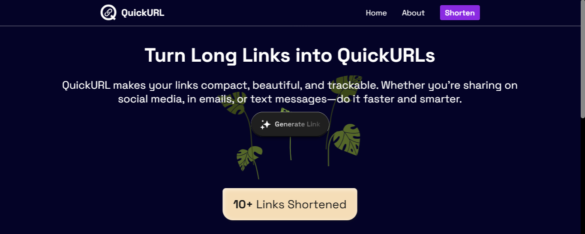
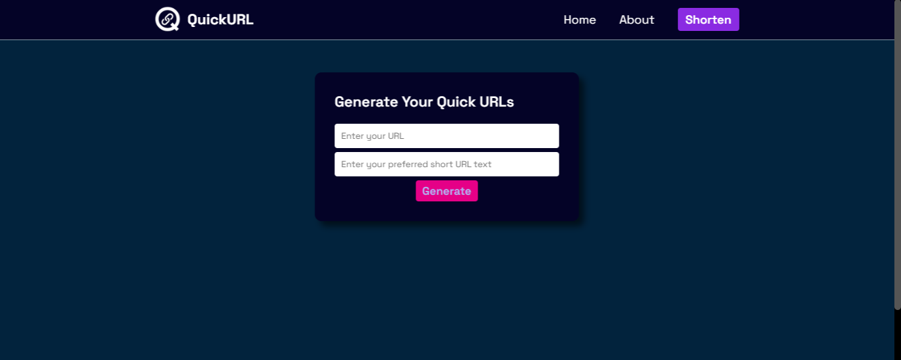

# QuickURL - URL Shortener
## 🚀 Overview
**QuickURL** is a simple and fast URL shortener built using **Next.js 15**. It allows users to shorten long URLs by generating custom, clean, and unique short links. The app does not require sign-in or authentication—just paste your long URL, provide a custom short keyword, and get your QuickURL instantly. All generated URLs are stored in **MongoDB** to ensure uniqueness and prevent duplication.

 

## 🚀 Screenshots

  

 

## 🚀 Features
- **No Sign-In Needed** – Users can shorten URLs instantly without creating an account
- **Instant Short Links** – Paste your original URL, add a keyword, and get a working short link immediately
- **Unique & Safe** – Each short word is stored in the database to ensure it can't be reused.
- **Deployed on Vercel** – Live, fast, and globally distributed deployment using Vercel.

 

## 🚀 Tech Stack
- **Frontend:** Next.js 15
- **Styling:** Vanilla CSS
- **Backend:** Next.js API Routes
- **Database:** MongoDB

 

## 🚀 Deployment
The app is deployed on <b>Vercel</b> and can be accessed via:
 
https://quickurl-shortener.vercel.app/

 

## 🚀 Contact
- LinkedIn: www.linkedin.com/in/ibadhussain